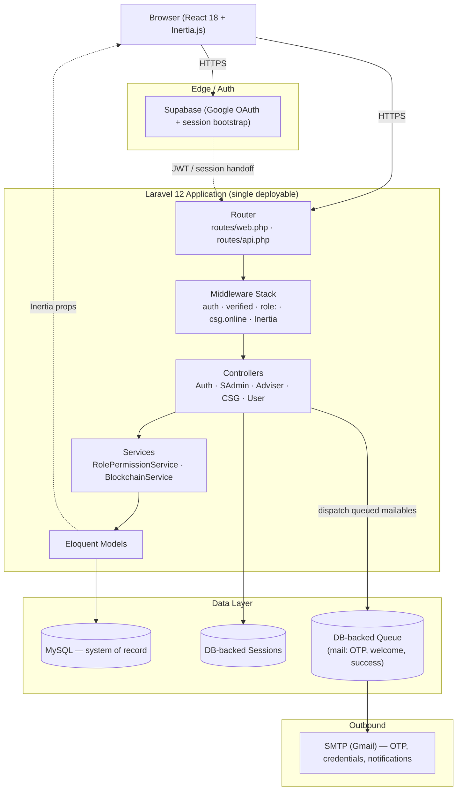

# 🎓 STEP — School Transparency & Evaluation Platform

<div align="center">


A role-based governance, evaluation, and financial-transparency platform for **Kolehiyo ng Lungsod ng Dasmariñas (KLD)**, built as a Laravel 12 + Inertia.js + React 18 monolith.

</div>

---

## 📋 Table of Contents

- [Problem Statement](#-problem-statement)
- [Architecture](#-architecture)
- [Documentation Map](#-documentation-map)
- [Tech Stack](#-tech-stack)
- [Core Modules](#-core-modules)
- [User Roles & Permission Matrix](#-user-roles--permission-matrix)
- [Local Setup](#-local-setup)
- [Development Workflow & CI/CD](#-development-workflow--cicd)
- [Observability](#-observability)
- [Common Pitfalls & Troubleshooting](#-common-pitfalls--troubleshooting)
- [Known Issues & Housekeeping](#-known-issues--housekeeping)
- [License & Contact](#-license--contact)

---

## 🎯 Problem Statement

Academic institutions running student governance (CSG) programs typically manage project approvals, budget disbursement, and performance evaluation across disconnected spreadsheets, paper trails, and email threads. This creates two concrete failure modes: **financial records that can be edited after the fact with no trace**, and **evaluation/rating data that stakeholders can't independently verify**.

STEP addresses this by giving every actor — student, teacher, CSG officer, adviser, and system admin — a single, role-scoped system of record, and by making CSG project ledgers **tamper-evident** via an internal cryptographic hash chain (see [Core Modules](#-core-modules)).

This is a monolith by design, not by accident: a single institution, a single database of record, and a request volume that doesn't currently justify the operational cost of a distributed system. If/when STEP needs to scale across institutions, the module boundaries below (Auth, Governance, Ledger, Ratings, Notifications) are already the natural seams for extraction into services.

---

## 🏗 Architecture

STEP is a **server-rendered monolith**: Laravel owns routing, auth, and business logic; Inertia.js hands fully-formed page props to React components with no separate REST/GraphQL API layer for the web app itself (a narrow `routes/api.php` surface exists for the chatbot widget and a subset of project/ledger endpoints).



**Key architectural decisions worth knowing before you touch this code:**

- **Auth is split across two systems.** Google OAuth identity is brokered through Supabase (`VITE_SUPABASE_URL` / anon key on the frontend, `SUPABASE_SERVICE_ROLE_KEY` for backend-trusted calls), while session state, roles, and permissions are owned entirely by Laravel's own `users`/`roles`/`permission` tables. Supabase is an identity provider here, not the system of record for authorization.
- **Authorization is two-layer.** Route groups apply coarse `role:` gating; a seeded `permission` / `role_permission` catalog (`RolePermissionService`) applies fine-grained module.action grants that Superadmin can edit at runtime, including per-CSG-position overrides. See [Permission Matrix](#-user-roles--permission-matrix).
- **The ledger integrity chain is application-level, not distributed.** `BlockchainService` builds a SHA-256 linked hash chain per approved CSG project (`Chain` model): a genesis block on approval, then one block per ledger entry, each hashing forward from the previous block's hash. It gives tamper-evidence for a single-writer system — explicitly not a consensus/DLT claim.
- **No message broker.** Background work (queued mailables) runs through Laravel's database queue driver, processed by `php artisan queue:listen` alongside the app — there is no Kafka/SQS/Redis-Streams layer in this system today.

---

## 🗺 Documentation Map

This README is the entry point, not the whole story. Deeper flows are documented separately at the repo root — read them before modifying the corresponding subsystem:

| Document | Covers |
|---|---|
| `ROLE_DASHBOARD_FLOW.md` | How each role's dashboard is composed and routed |
| `ROLE_SWITCH_FLOW.txt` | How a user with multiple role assignments switches context |
| `RATING_LOGIC_FLOW_MAP.txt` | Rating computation, aggregation, and moderation logic |
| `USER_RATING_SUBMISSION_FLOW.txt` | End-to-end student/teacher rating submission flow |
| `RATINGS_TAB_ENHANCEMENT_UPDATE.txt` | Change log for the ratings UI/logic revisions |
| `COMPLETENESS_ENGAGEMENT_RATINGS_IMPLEMENTATION.txt` | Engagement/completeness scoring implementation notes |
| `NOTIFICATION_FLOW.txt` | Notification triggers, channels, and delivery logic |
| `IMPLEMENTATION_COMPLETE.txt` | Historical implementation-completion log |

> These are working engineering notes rather than polished docs — treat them as the most accurate source for subsystem-level detail, and prefer updating them over letting logic drift undocumented.

---

## 🛠 Tech Stack

| Layer | Technology | Notes |
|---|---|---|
| Backend framework | Laravel 12 (PHP 8.2+) | `inertiajs/inertia-laravel`, `laravel/sanctum` |
| Frontend | React 18 + Inertia.js | Server-driven routing, no separate SPA build |
| Styling | Tailwind CSS 3 | |
| Build tool | Vite | |
| Database | MySQL 8.0 / MariaDB 10.4+ | `sqlite` supported for quick local bootstrap only |
| Identity provider | Supabase (Google OAuth) | Session/authorization stays in Laravel |
| Mail | SMTP (Gmail), Laravel Mailables | 2 of 4 mailables are queued (`ShouldQueue`) |
| Queue | Laravel database queue driver | No broker; requires a running `queue:listen` worker |
| Testing | PHPUnit 11 | `tests/Feature`, `tests/Unit` |
| Code style | Laravel Pint (PSR-12) | |

---

## 🔧 Core Modules

| Module | Responsibility | Key classes |
|---|---|---|
| **Auth & Onboarding** | Google OAuth handoff, email-domain enforcement (`@kld.edu.ph`), OTP, role-based onboarding, temp password issuance | `GoogleAuthController`, `OTPController`, `OnboardingController` |
| **Governance (CSG)** | Project lifecycle (create → submit → approve/reject), council positions/terms, meetings | `CSGProjectController`, `AdviserApprovalController`, `CsgPosition` |
| **Ledger & Integrity Chain** | Financial entries per project, SHA-256 linked hash chain, integrity verification | `LedgerEntryController`, `BlockchainService`, `Chain` |
| **Ratings & Engagement** | Student/teacher rating submission, moderation, aggregation, gamification (points/badges/leaderboard) | `UserProjectController`, `AdviserRatingsController` |
| **Admin & RBAC** | User management, role/permission grant editing, system-wide audit logs | `UserManagementController`, `RolePermissionService`, `AuditLog` |
| **Notifications** | In-app + email notifications across role dashboards | `*NotificationController` (per-role), `Notification` models |

---

## 👥 User Roles & Permission Matrix

STEP has six role slugs enforced in two layers: coarse `role:` route middleware, and a fine-grained permission catalog editable at runtime by Superadmin (including per-CSG-position overrides).

| Capability | Student | Teacher | CSG Officer | Council Adviser / SADU Admin | Superadmin |
|---|:---:|:---:|:---:|:---:|:---:|
| View projects | ✅ | ✅ | ✅ | ✅ | ✅ |
| Create / edit / delete projects | ❌ | ❌ | ✅ | ❌ | ✅ |
| Approve projects | ❌ | ❌ | ❌ | ✅ | ✅ |
| Submit ratings | ✅ | ✅ | ❌ | ❌ | ✅ |
| View / moderate ratings | ✅ (own) | ✅ (own) | ✅ (view) | ✅ (view) | ✅ (moderate) |
| Create / edit ledger entries | ❌ | ❌ | ✅ | ❌ | ✅ |
| Approve ledger entries | ❌ | ❌ | ❌ | ✅ | ✅ |
| Upload proof documents | ❌ | ❌ | ✅ | ✅ (view only) | ✅ |
| Create / approve meeting minutes | ❌ | ❌ | ✅ (create) | ✅ (approve) | ✅ |
| View ledger integrity chain | ❌ | ❌ | ✅ (own projects) | ✅ | ✅ |
| Manage users (create/disable/reset/role) | ❌ | ❌ | ❌ | ❌ | ✅ |
| Edit role/permission grants & CSG positions | ❌ | ❌ | ❌ | ❌ | ✅ |
| View system-wide audit logs | ❌ | ❌ | ❌ | ❌ | ✅ |
| System configuration | ❌ | ❌ | ❌ | ❌ | ✅ |

**Caveats that matter before you rely on this table:**
- Several `/sadmin/*` routes (Data Backup, Organizations, System Settings, Global Reports, Engagement Rules, Master Data) currently render static placeholder pages with no backing controller — scaffolded, not shipped.
- The `role:superadmin` route group is annotated in `routes/web.php` itself as *"Temporarily without middleware for testing"* — confirm this is hardened before any public-facing deployment.
- CSG grants can be further scoped per council position (President vs. Treasurer, etc.) at runtime — not reflected as a static default above.

---

## 📦 Local Setup

### Prerequisites

- PHP 8.2+, Composer
- Node.js 16+, npm
- MySQL 8.0 / MariaDB 10.4+
- Git

### Setup

```bash
git clone https://github.com/JamesTamayo-Imben/step22.git
cd step22

composer install
npm install

cp .env.example .env
php artisan key:generate

php artisan migrate
```

### Critical Environment Variables

> Values below are **mock placeholders** for reference only. Never commit a populated `.env` file — including under a non-standard filename — to version control.

| Variable | Purpose | Example (mock) |
|---|---|---|
| `APP_KEY` | Laravel encryption key, generated locally | `base64:GENERATE_WITH_ARTISAN_KEY_GENERATE=` |
| `APP_URL` | Base URL used for signed links/emails | `http://localhost:8000` |
| `DB_CONNECTION` / `DB_HOST` / `DB_DATABASE` / `DB_USERNAME` / `DB_PASSWORD` | MySQL connection | `mysql` / `127.0.0.1` / `step_local` / `root` / `changeme` |
| `SESSION_DRIVER` | Session storage backend | `database` |
| `QUEUE_CONNECTION` | Queue backend for mailables | `database` (requires a running `queue:listen` worker — see [Pitfalls](#-common-pitfalls--troubleshooting)) |
| `MAIL_MAILER` / `MAIL_HOST` / `MAIL_PORT` / `MAIL_USERNAME` / `MAIL_PASSWORD` | Outbound SMTP for OTP/credential/notification emails | `smtp` / `smtp.gmail.com` / `587` / `no-reply@yourdomain.edu` / `use an app password, not your login password` |
| `VITE_SUPABASE_URL` | Supabase project URL (frontend-exposed) | `https://your-project.supabase.co` |
| `VITE_SUPABASE_ANON_KEY` | Supabase public anon key (frontend-exposed, RLS-bound) | `sb_publishable_xxxxxxxxxxxxxxxx` |
| `SUPABASE_SERVICE_ROLE_KEY` | Backend-only key that **bypasses Row Level Security** | `⚠️ server-side only — never expose to the frontend or commit to git` |

```bash
# Terminal 1 — app server
php artisan serve

# Terminal 2 — queue worker (required for OTP/welcome/success mail)
php artisan queue:listen --tries=1

# Terminal 3 — frontend build
npm run dev
```

Or run all three concurrently via `composer dev`.

---

## 🚀 Development Workflow & CI/CD

**Current state: there is no CI/CD pipeline in this repository today** (no `.github/workflows`, no containerization). The steps below are what's runnable locally now, followed by the recommended pipeline this project should adopt before any production deployment.

### What exists today (run before every PR)

```bash
php artisan pint          # PSR-12 style fix (backend)
php artisan test          # PHPUnit: tests/Feature + tests/Unit
npm run build             # Vite production build sanity check
```

### Recommended pipeline (not yet implemented — proposed target state)

```
lint (Pint + ESLint) → test (PHPUnit + npm test) → build (composer + vite) → deploy
```

| Stage | Tooling | Gate |
|---|---|---|
| Lint | `laravel/pint`, ESLint (frontend linting not yet configured) | Fails PR on style violations |
| Test | `php artisan test`, target ≥80% coverage per existing contribution guidelines | Fails PR on any failing test or coverage regression |
| Build | `composer install --no-dev`, `npm run build` | Fails PR on build error |
| Deploy | Manual/SSH today; target: tagged release → environment promotion | Requires passing lint+test+build and one approving review |

### Merge requirements

1. Feature branch off `main`: `git checkout -b feature/your-feature`
2. Pint + PHPUnit pass locally before opening a PR
3. At least one reviewer approval
4. No direct pushes to `main`

---

## 📊 Observability

**Current state** — this is a single-instance monolith, so observability is file/log-based rather than a metrics/tracing stack:

| Signal | Where to find it |
|---|---|
| Application logs | `storage/logs/laravel.log` (`tail -f storage/logs/laravel.log`), or live-stream via `php artisan pail` |
| Domain audit trail | `audit_logs` table (`AuditLog` model) — user actions, module, IP, browser info; queryable by Superadmin at `/sadmin/system-logs` |
| Ledger integrity | Per-project chain verification via `BlockchainController@verify` — recomputes hashes and reports whether the chain is intact |
| Queue health | No dashboard today — inspect the `jobs` / `failed_jobs` tables directly, or run `php artisan queue:failed` |
| Errors | Laravel's default exception handler + `storage/logs` — no external error tracker (Sentry/Bugsnag) wired up today |

**Gaps to flag for anyone hardening this for production:** no metrics export (Prometheus-style), no distributed tracing (not applicable to a single-process monolith, but request-level timing/APM is still absent), and no alerting on `failed_jobs` growth — currently an operator has to notice manually.

---

## 🐛 Common Pitfalls & Troubleshooting

### 1. Queued OTP/welcome emails never arrive

**Symptom**: `Mail::to(...)->send(...)` appears to succeed, user reports never receiving the OTP or welcome email.
**Cause**: `OTPMail` and `SuccessMail` implement `ShouldQueue`, but `QUEUE_CONNECTION=database` only *stores* the job — nothing dispatches it without a running worker.
**Fix**: Confirm `php artisan queue:listen` (or `queue:work`) is running in every environment, including production. Check `SELECT * FROM jobs` / `SELECT * FROM failed_jobs` to see if mail is stuck rather than lost.

### 2. Ledger integrity chain reports as broken after a legitimate edit

**Symptom**: `BlockchainController@verify` reports a hash mismatch after someone edits a historical ledger entry directly (e.g. via a DB tool or a bug in an update path that doesn't go through `BlockchainService`).
**Cause**: The chain is intentionally tamper-evident — any out-of-band write to a ledger row invalidates every subsequent hash. This is a data-consistency signal working as designed, not a bug, but it will look alarming if the team doesn't know how it fails.
**Fix**: All ledger mutations must go through `BlockchainService::addBlockToChain`. If a chain break is confirmed post-incident, the correct remediation is a documented, audited resync — never a silent hash rewrite, which defeats the entire purpose of the chain.

### 3. Race condition on concurrent ledger writes to the same project

**Symptom**: Two ledger entries submitted near-simultaneously for the same project occasionally produce a chain with a duplicated `block_index` or an incorrect `prev_hash` link.
**Cause**: `BlockchainService::addBlockToChain` reads the latest block (`orderByDesc('block_index')->first()`) and then writes a new one — this read-then-write is not wrapped in a row-level lock or DB transaction with `lockForUpdate()`, so concurrent requests can both read the same "latest" block before either commits.
**Fix**: Wrap the read-latest-block + insert-new-block sequence in a DB transaction with `lockForUpdate()` on the project's chain rows, or serialize ledger writes per-project at the application layer (e.g. a per-project mutex/queue) until that locking is added.

### 4. Session appears to log the user out when switching between role dashboards

**Symptom**: A user with a CSG position who is also a student reports being redirected to login when moving between `/user/*` and `/csg/*` routes.
**Cause**: `role:` middleware checks a single `role_id` on `users`, loaded via `HandleInertiaRequests`. If the relationship isn't eagerly reloaded after a role/position change mid-session, stale role data can trigger a false negative in `CheckRole`.
**Fix**: Force a session/role reload after any role or CSG-position mutation (`$user->load('role')` before the next `role:` check), rather than relying on data cached earlier in the request lifecycle.

---

## 🧹 Known Issues & Housekeeping

- **Secrets in tracked files**: `.env.example` and a stray `.env-with HTTPS` file have previously contained live credentials (Supabase service role key, Gmail app password, `APP_KEY`). If you're standing this project up, generate fresh credentials — do not reuse any value that has appeared in this repo's history — and rotate the Supabase and Gmail credentials regardless, since git history retains them even after deletion.
- **Duplicate/scratch files**: `composer copy.json`, `composer - Copy.lock`, `routes/web copy.php`, `BulkRegistrationController copy.php`, and multiple historical `step_system_database*.sql` dumps are present and pending cleanup. Treat the non-`copy` file as canonical.
- **Legacy duplicate models**: `Rating1`, `Project1`, `Notification1`, `LedgerEntry1` exist alongside their namespaced equivalents (`User\Rating`, `User\Project`, etc.) — new work should target the namespaced versions; consolidation is planned.
- **Repo size**: demo videos and images are committed directly (~97MB) rather than via Git LFS or external hosting — inflates every clone.

---

## 📄 License & Contact

Licensed under the **MIT License** — see [`LICENSE`](LICENSE) for full terms.

**Maintainer**: James Tamayo-Imben
**Support / Issues**: [GitHub Issues](https://github.com/JamesTamayo-Imben/step22/issues)
**Institution**: Kolehiyo ng Lungsod ng Dasmariñas (KLD)

---

**Last Updated**: August 23, 2026
**Version**: 1.0.0